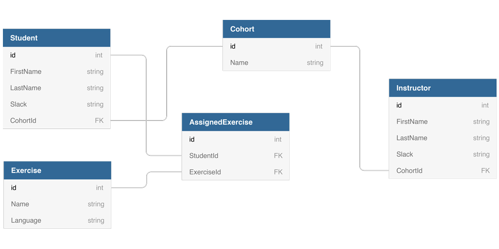

# Student Exercises Part 1: Custom Types

## Instructions
You are going to build a console application that tracks exercises that are assigned to students at Nashville Software School.

## Entity Relationship Diagram


## Setup
Make sure that each class you define is in its own file. Also make sure each class is in the `StudentExercises` namespace.

### Student
You must define a type for representing a student in code. A student can only be in one cohort at a time. A student can be working on many exercises at a time.

**Properties:** First name, Last name, Slack handle, the student's cohort, the collection of exercises that the student is currently working on

### Cohort
You must define a type for representing a cohort in code.

**Properties:** The cohort's name, collection of students in the cohort, collection of instructors in the cohort

### Instructor
You must define a type for representing an instructor in code.

**Properties:** First name, Last name, Slack handle, the instructor's cohort, a method to assign an exercise to a student

### Exercise
You must define a type for representing an exercise in code. An exercise can be assigned to many students.

**Properties:** Name of exercise, language of exercise (JavaScript, Python, CSharp, etc.)

## Objective
The learning objective of this exercise is to practice creating instances of custom types that you defined with class, establishing the relationships between them, and practicing basic data structures in C#.

Once you have defined all of your custom types, go to your Main() method in Program.cs and implement the following logic.

- Create 4, or more, exercises.
- Create 3, or more, cohorts.
- Create 4, or more, students and assign them to one of the cohorts.
- Create 3, or more, instructors and assign them to one of the cohorts.
- Have each instructor assign 2 exercises to each of the students.

## Challenge

1. Create a list of students. Add all of the student instances to it.

```cs
List<Student> students = new List<Student>();
```

2. Create a list of exercises. Add all of the exercise instances to it.

```cs
List<Exercise> exercises = new List<Exercise>();
```

Generate a report that displays which students are working on which exercises.

